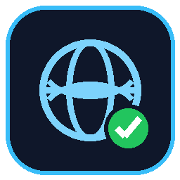

# IPNET

### 🇺🇸 بروكسي أمريكي بضغطة واحدة — شبكتك الأمريكية الخاصة

سيرفر أمريكي مجاني (GitHub Actions) · برنامج ويندوز · اشتراك للموبايل

 

 

---

## 1️⃣ اعمل سيرفرك (مرة واحدة فقط)

> الإعداد ده بتعمله مرة واحدة بس، وبعدها تقدر تتصل في أي وقت.

| الخطوة | الشرح |
|:---:|---|
| **1** | افتح [`X5Coder/IPNET`](https://github.com/X5Coder/IPNET) ← دوس **Use this template** ← اعمل مستودعك الخاص (لازم يكون **Public**). |
| **2** | في مستودعك الجديد افتح تبويب **Actions** وشغّل **USA Proxy** لو مش شغال لوحده. |

---

## 2️⃣ التشغيل على ويندوز

| الخطوة | الشرح |
|:---:|---|
| **1** | دوس على [**IPNET.exe**](https://github.com/X5Coder/IPNET/releases/latest/download/IPNET.exe) — بيحمّل مباشرة. شغّله. |
| **2** | الصق **رابط مستودعك** جوه البرنامج ← دوس **Start**. كروم بيفتح بـ IP أمريكي. |
| **3** | في كل مرة بعد كده: الرابط بيكون محفوظ لوحده — بس دوس **Start**. |

---

## 3️⃣ التشغيل على أندرويد

| الخطوة | الشرح |
|:---:|---|
| **1** | دوس على [**v2rayNG.apk**](https://github.com/2dust/v2rayNG/releases/download/2.2.6/v2rayNG_2.2.6_arm64-v8a.apk) للتحميل، وبعدين ثبّته. |
| **2** | من القائمة أعلى اليسار افتح **Subscription group setting** ← دوس **+** واملأ الحقول تحت. |

**بيانات الاشتراك:**

| الحقل | القيمة |
|---|---|
| `remarks` | `IPNET` |
| `Optional URL` | رابط اشتراكك، مثال: `https://raw.githubusercontent.com/YOU/YOUR-REPO/main/sub.txt` *(بدّل `YOU/YOUR-REPO` باسم مستودعك)* |
| `Enable update` | ✅ شغّال |
| `Enable automatic update` | ✅ شغّال — المدة `60` |

بعدين دوس **✓** للحفظ.

| الخطوة | الشرح |
|:---:|---|
| **3** | من الشاشة الرئيسية دوس **⋮** ← **Update subscription** ← دوس على `IPNET-USA` ← دوس **▶** ← وافق على صلاحية VPN. |
| **4** | اتأكد إن الاتصال شغال من [ipleak.net](https://ipleak.net/) — المفروض يظهر **United States**. |
| **5** | لو وقف بعدين: اعمل ريستارت للخدمة من الإشعار، وبعدين **⋮** ← **Update subscription** ← اتصل تاني. |

---

## ⭐ ادعم المشروع

لو IPNET شغال معاك، دوس **نجمة (Star)** للمستودع — بتاخد ٥ ثواني وبتساعد المشروع يفضل شغال 🙏

  

 

